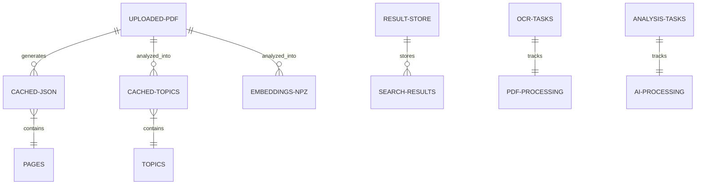
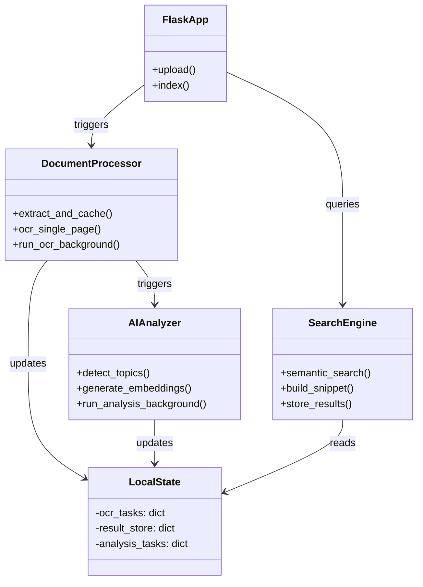
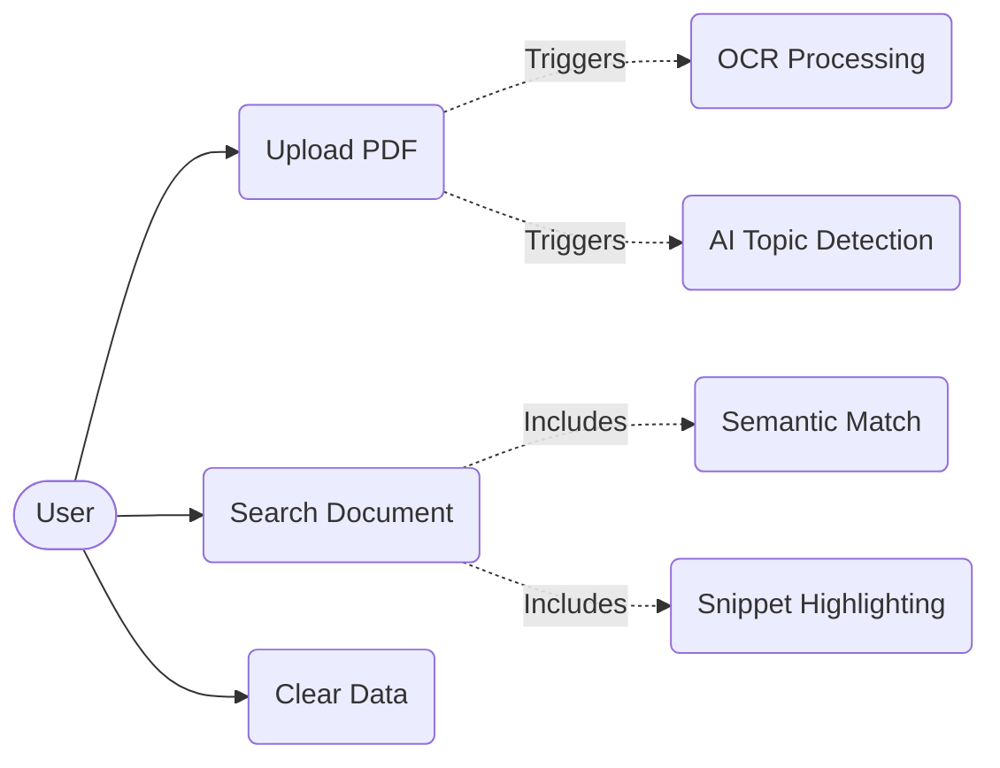
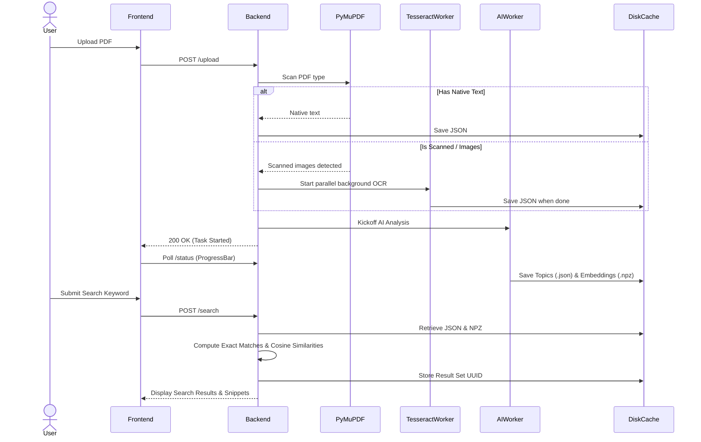
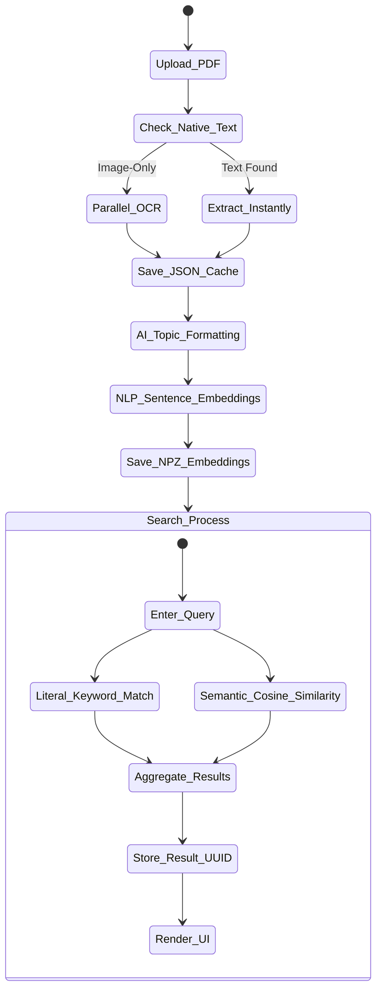
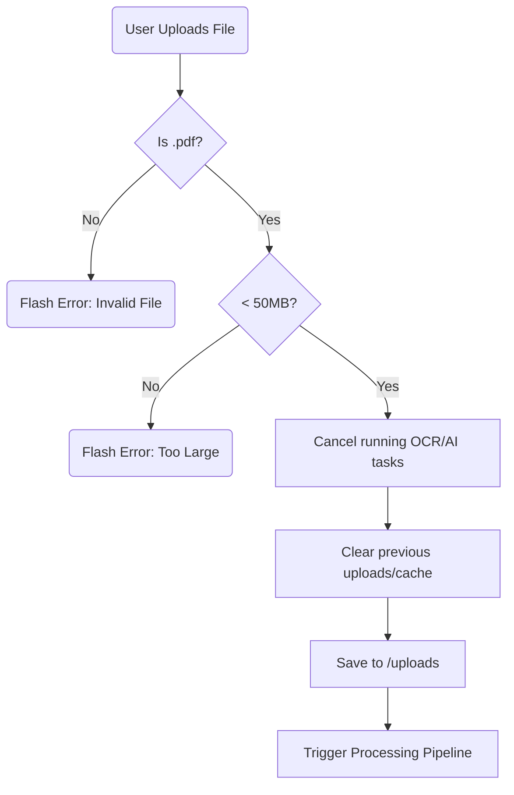
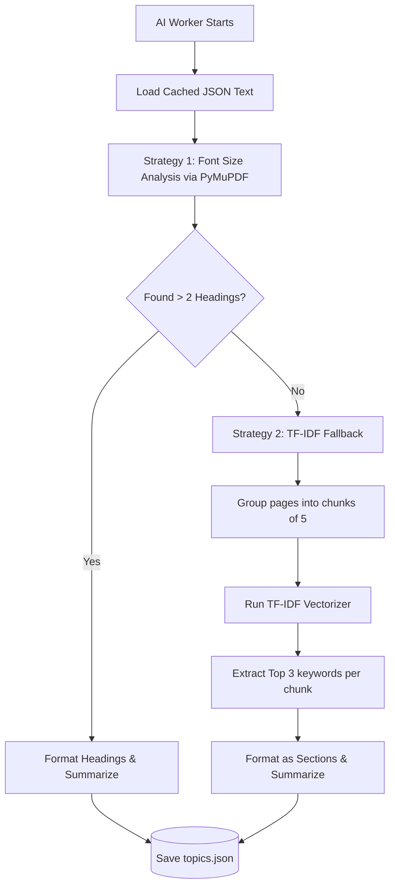
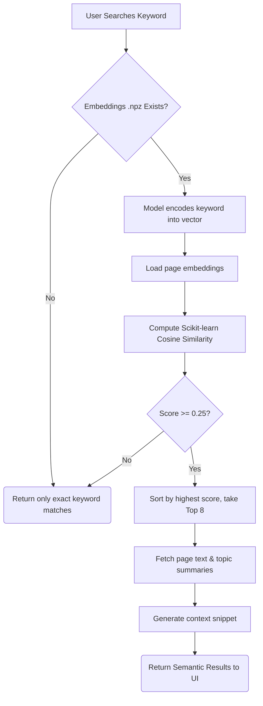

# 📄 Smart PDF Search Engine v2

A powerful, locally-hosted document intelligence and search application. This tool goes beyond basic text matching by integrating **Optical Character Recognition (OCR)**, **AI-Powered Semantic Search**, and **Intelligent Topic Detection** to help you extract insights from any PDF document—whether it's natively digital or a scanned image.


---

## ✨ Key Features

### 🔍 Advanced Search Capabilities
- **Exact Keyword Search**: Instantly find specific terms across all pages with context-aware highlighted snippets.
- **🧠 Semantic Search (v2)**: Powered by `sentence-transformers` (`all-MiniLM-L6-v2`), search queries are embedded to find philosophically and contextually similar topics, even if the exact keyword is missing from the document.

### 📑 Intelligent Document Analysis
- **Topic & Chapter Detection**: Automatically analyzes document structures by examining font sizes and weights via PyMuPDF to deduce architectural headings.
- **TF-IDF Fallback**: If structural headings aren't found, the app uses Term Frequency-Inverse Document Frequency (TF-IDF) to analyze page chunks and generate summarized topic labels.

### 👁️ Robust OCR & PDF Parsing
- **Lightning Native Extraction**: Instantly parses digital PDFs using PyMuPDF.
- **Parallel Scanned PDF Processing**: Detects image-only pages and deploys Tesseract OCR across multiple CPU threads simultaneously for rapid text extraction.

### ⚡ Performance & UX
- **Real-Time Progress Tracking**: Heavy OCR and AI embedding generation happens in background threads, mapped to live UI progress bars—you're never left waiting blindly.
- **Smart Local Caching**: Extracted text (`.json`), detected topics (`.topics.json`), and generated embeddings (`.npz`) are cached to disk. Subsequent searches and page loads are nearly instantaneous.
- **Graceful Interruptions**: Re-uploading files instantly and safely cancels any background OCR or embedding tasks.
- **Server-Side Result Storage**: Avoids memory limitations and cookie bloat by securely storing search sessions on the backend.
- **Dark & Light Themes**: Accessible, modern UI built with Bootstrap 5 and smooth transitions.
- **100% Private**: Everything (including machine learning models) runs locally on your machine. Zero data leaves your computer.

---

## 🛠️ Technology Stack

| Architecture Layer | Technologies Used |
|--------------------|-------------------|
| **Backend & Routing** | Flask, Werkzeug |
| **PDF Processing** | PyMuPDF (fitz) |
| **Optical Character Recognition** | Tesseract OCR, pytesseract, Pillow |
| **Machine Learning & NLP** | `sentence-transformers`, `scikit-learn` (TF-IDF, Cosine Similarity), `numpy` |
| **Generative Pipeline** | ThreadPoolExecutor (Parallel processing) |
| **Frontend** | HTML5, CSS3, Vanilla JS, Bootstrap 5, Google Fonts (Inter) |

---

## 📁 Project Architecture

```text
project/
├── app.py              # Application core, routing, background workers, AI logic
├── templates/
│   └── index.html      # Responsive single-page UI (Search, Results, Progress)
├── uploads/            # Temporary storage for uploaded PDFs (git-ignored)
├── cache/              # Cached text extractions and topic summaries (git-ignored)
├── embeddings/         # Cached sentence-transformer .npz files (git-ignored)
├── venv/               # Python virtual environment
├── .gitignore
└── README.md           # Project documentation
```

---

## 🚀 Getting Started

### 1. System Prerequisites

- **Python 3.8+**
- **Tesseract OCR** installed on your system.

#### Installing Tesseract
- **Windows**: Download the installer from [UB Mannheim](https://github.com/UB-Mannheim/tesseract/wiki) and install to `C:\Program Files\Tesseract-OCR\`. (Ensure the path is correct as it is hardcoded in `app.py`).
- **macOS**: `brew install tesseract`
- **Linux (Debian/Ubuntu)**: `sudo apt install tesseract-ocr`

### 2. Installation

Clone the repository and navigate into the directory:
```bash
git clone <your-repo-url>
cd project
```

Create and activate a virtual environment:
```bash
# Verify Python version first
python -m venv venv

# Windows
venv\Scripts\activate

# macOS / Linux
source venv/bin/activate
```

Install the required Python dependencies:
```bash
pip install flask PyMuPDF pytesseract Pillow markupsafe werkzeug sentence-transformers scikit-learn numpy
```
*(Note: Running the app for the first time will automatically download the ~90MB `all-MiniLM-L6-v2` embedding model).*

### 3. Running the Application

Start the Flask development server:
```bash
python app.py
```

Access the application in your browser:
```text
http://127.0.0.1:5000
```

---

## 📖 Usage Guide

1. **Upload**: Drag and drop or browse to upload a `.pdf` file (Up to 50MB by default).
2. **Processing Pipeline**: 
    - The engine first checks for native text.
    - If empty, the multithreaded OCR engine processes the document, showing a live progress bar.
    - An AI Background Worker then begins Topic Detection and Semantic Embedding generation.
3. **Search**: 
    - Enter a search query or keyword.
    - If found exactly, you'll receive highlighted contextual snippets.
    - The system will also perform a **Semantic Search**, retrieving pages and overarching topics contextually related to your query through AI vector matching.
4. **Clean Up**: Use the **Clear All Files** button to purge the `uploads`, `cache`, and `embeddings` directories.

---

## ⚙️ Core Configuration

Configuration settings can be tweaked inside `app.py`:

| Setting Variable | Default | Description |
|------------------|---------|-------------|
| `MAX_CONTENT_LENGTH` | 50 MB | Enforces maximum upload file size limit. |
| `SNIPPET_RADIUS` | 300 chars | Defines context length around highlighted keyword snippets. |
| `OCR_DPI` | 150 | Determines the render resolution for scanned PDF pages. |
| `MAX_RESULT_STORE` | 50 | Purges oldest server-side results to prevent session bloat. |
| `SEMANTIC_THRESHOLD` | 0.25 | Minimum Cosine Similarity score for a semantic match to surface. |
| `MAX_SEMANTIC_RESULTS` | 8 | The maximum number of semantic results to display per search. |

---

## 📊 System Diagrams

### 1. Entity-Relation Diagram (Data Structures)


### 2. Data Flow Diagram (DFD)
```mermaid
flowchart TD
    User([User]) -->|Uploads PDF| FlaskApp(Flask App)
    FlaskApp -->|Checks pages| PyMuPDF{PyMuPDF Native Text?}
    PyMuPDF -->|Yes| CacheJSON[(Cache JSON)]
    PyMuPDF -->|No (Scanned)| OCRWorker[OCR Worker Thread]
    OCRWorker -->|Extracts Text| CacheJSON
    
    CacheJSON --> AIWorker[AI Analysis Worker]
    AIWorker -->|Font/TF-IDF Analysis| CacheTopics[(Topics JSON)]
    AIWorker -->|sentence-transformers| CacheEmbeddings[(Embeddings NPZ)]
    
    User -->|Enters Query| SearchLogic(Search Engine)
    SearchLogic -->|Reads| CacheJSON
    SearchLogic -->|Reads| CacheTopics
    SearchLogic -->|Reads| CacheEmbeddings
    SearchLogic -->|Saves| ResultStore[(Result Store UUID)]
    ResultStore -->|Returns Display| UI(Display UI)
    UI --> User
```

### 3. Module / Class Diagram


### 4. Use Case Diagram


### 5. Sequence Diagram


### 6. Activity Diagram


### 7. File Upload & Validation Flowchart


### 8. AI Topic Detection Flowchart


### 9. Semantic Search Ranking Flowchart


---

## 📜 License

This project is open source and available under the [MIT License](LICENSE).

---
> Engineered with ❤️ using Flask, PyMuPDF, sentence-transformers, and Tesseract OCR.
